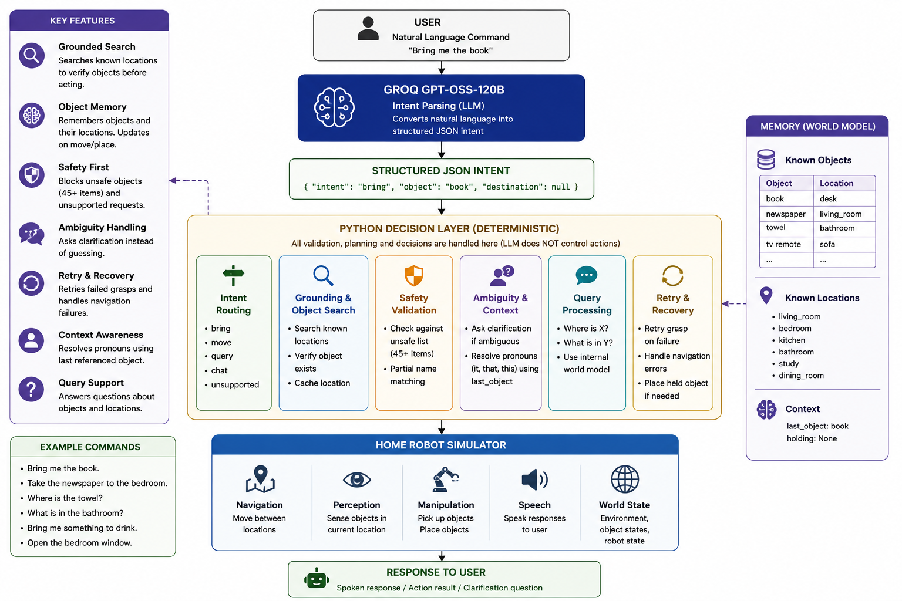

#  Home Robot Language Control

An AI-powered home robot that understands natural language commands and safely executes them using a deterministic decision layer.

The project combines a Large Language Model (Groq GPT-OSS-120B) for intent parsing with Python-based planning, grounding, safety checking, ambiguity resolution, and recovery.

---

## Demo

[watch video](https://github.com/pritish73/Home-Robot-Language-Control/blob/main/assets/demo.mp4)

## System Architecture

<p align="center">
  
</p>

## LinkedIn post
[post 1](https://www.linkedin.com/posts/pritish-dutta-06aa43247_artificialintelligence-generativeai-llm-ugcPost-7478739693250060288-dGzL/?utm_source=share&utm_medium=member_desktop&rcm=ACoAAD0zQJIBTT7YkZT3zGLrbmrNSVHJ3tvqSak)
[post 2](https://www.linkedin.com/posts/pritish-dutta-06aa43247_artificialintelligence-llm-agenticai-share-7478740882821672960-MkWw/?utm_source=share&utm_medium=member_desktop&rcm=ACoAAD0zQJIBTT7YkZT3zGLrbmrNSVHJ3tvqSak)

## Features

-  Natural Language Understanding
-  Object Memory
-  Grounded Object Search
-  Safety Validation
-  Ambiguity Handling
-  Retry & Recovery
-  Context & Pronoun Resolution
-  Object Manipulation
-  Environment Queries
-  Unsupported Request Handling

---

## Architecture

```
User
   │
   ▼
Groq LLM
(Intent Parsing)
   │
   ▼
JSON Intent
   │
   ▼
Python Decision Layer
   │
   ├── Safety Checks
   ├── Grounding
   ├── Search
   ├── Recovery
   ├── Memory
   └── Execution
   │
   ▼
Robot Simulator
```

---

## Example Commands

```
Bring me the book.

Take the newspaper to the bedroom.

Where is the towel?

What is in the bathroom?

Bring me something to drink.

Open the bedroom window.
```

---

## Technologies

- Python
- Groq API
- GPT-OSS-120B
- python-dotenv

---

## Running

```bash
pip install -r requirements.txt

python run.py

python run.py --test

python run.py --ascii
```

---

## Design

The LLM performs **only intent parsing**.

All planning, safety, grounding, recovery, and execution are implemented using deterministic Python logic.

---

## Author

**Pritish Dutta**

